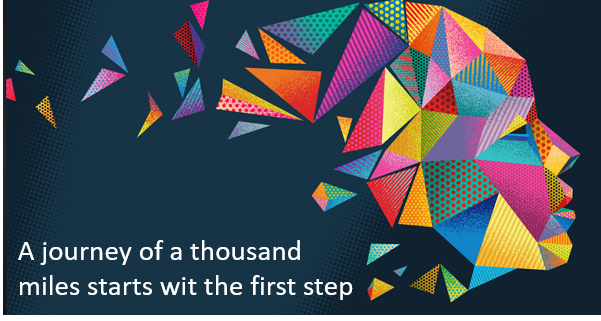

# Artificial Intelligence

- [1. Overview](#1-overview)
- [2. About the repo](#2-about-the-repo)
- [3. References](#3-references)
  - [3.1. Supporting GitHub techniques](#31-supporting-github-techniques)

## 1. Overview

 Artificial Intelligence (AI) is a branch of computer science and a
 multidisciplinary field that deals with the development of intelligent machines
 and systems capable of performing tasks that typically require human
 intelligence.

 > [!IMPORTANT] 
 > :thumbsup: AI aims to create computer programs or algorithms that can `learn`,
 `reason`, `perceive` their environment, and `make decisions` to achieve specific
 goals.

AI can be broadly categorized into two main types:

> [!NOTE]  
> **Narrow or Weak AI**. This form of AI is designed to excel in a specific task or a limited set of tasks. It is highly specialized and lacks general intelligence. Examples of narrow AI include voice assistants like Siri or Alexa, recommendation systems used by streaming platforms, and chatbots used for customer service.

> [!WARNING]  
> **General or Strong AI**. This type of AI is hypothetical and refers to machines that possess human-level intelligence. General AI would have the ability to understand, learn, and apply knowledge in a manner similar to humans across various domains. As of now, true general AI does not exist, and its development remains a subject of research and speculation.
> 
> Despite its numerous benefits, AI also raises `ethical` and `societal concerns`, such as privacy, job displacement, bias in algorithms, and potential misuse of AI technologies.

## 2. About the repo

This repo shows practical examples on how to use [OpenaAi](https://openai.com/) API. In particular, it shows how to use the OpenAI components.

Where

- **ChatGPT**. This is a web conversational interface that allows you to interact with ChatGPT language models.
- **DALL-E**. It allows you to create realistic images and art from the description you provide.
- **API**. It allows you to integrate OpenAI models into your apps.

> [!NOTE]
> ChatGPT stands for **Chat Generative Pre-trained Transformer**.

One of the sources of the examples shown here is the Udemy class: [ChatGPT Masterclass - Build Solutions and Apps with ChatGPT](https://www.udemy.com/course/chatgpt-build-solutions-and-apps-with-chatgpt-and-openai/).

The following figure shows the examples execution environment.

The user can interact with OpenAI API from the *localhost* for testing and use the [Azure Functions](https://docs.google.com/document/d/e/2PACX-1vQJ4SRjtxJneZQ9cHzVHvgby8H7HScbznm04Q7fFn4DDjDbfgiP57De2rJgRo-yAHV19g0XtuTTadX3/pub#h.ib4yzunwqg7n) in production to interact with OpenAI API in a serveless fashion.

To create and test the examples shown, you need the following tools and settings:

- OpenAI account
- Visual Studio Code installed
- Axure account (Azure Functions)
- Postman account

The applications we'll build have the following architecture:

Find all the supporting information in the companion document [Artificial Intelligence](https://docs.google.com/document/d/e/2PACX-1vQJ4SRjtxJneZQ9cHzVHvgby8H7HScbznm04Q7fFn4DDjDbfgiP57De2rJgRo-yAHV19g0XtuTTadX3/pub) 

## 3. References

- [Artificial Intelligence](https://docs.google.com/document/d/e/2PACX-1vQJ4SRjtxJneZQ9cHzVHvgby8H7HScbznm04Q7fFn4DDjDbfgiP57De2rJgRo-yAHV19g0XtuTTadX3/pub) - Supporting information in the companion document
- [OpenaAI](https://openai.com/)
- [ChatGPT Masterclass - Build Solutions and Apps with ChatGPT](https://www.udemy.com/course/chatgpt-build-solutions-and-apps-with-chatgpt-and-openai/)

### 3.1. Supporting GitHub techniques

- [Quickstart for writing on GitHub](https://docs.github.com/en/get-started/writing-on-github/getting-started-with-writing-and-formatting-on-github/quickstart-for-writing-on-github)
- [All-Github-Emoji-Icons](https://github.com/scotch-io/All-Github-Emoji-Icons)
- [[Markdown] An option to highlight a "Note" and "Warning" using blockquote (Beta)](https://github.com/orgs/community/discussions/16925)
